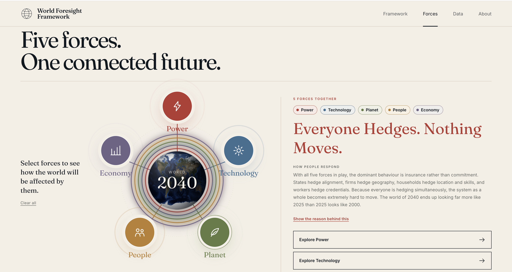

# World Foresight Framework 2040

**The future will not change one system at a time. This project helps you see how the pieces move together.**

**[Explore the live experience →](https://world-foresight-framework-2040.pages.dev/)**



## The future is not one story

When people talk about 2040, they often focus on one subject. They talk about artificial intelligence, climate change, shifting power, ageing societies, or the economy. Each subject matters, but none of them moves alone.

Climate pressure changes where people can live. Migration changes politics. Technology changes who can work, organise, compete, and govern. Economic pressure shapes which countries can adapt. Power determines whose rules matter when those systems collide.

I built the **World Foresight Framework** to explore those connections as one story.

The framework follows **190 indicators across 34 countries**, from 2000 to 2040. It organises them around five forces: **Power, Technology, Planet, People, and Economy**. Instead of declaring one inevitable future, it compares patterns, tests relationships, and shows the evidence behind each conclusion.

This is not a crystal ball. It is a structured way to think more carefully about what may come next.

## What this framework can give you

### 1. A connected view of the world

You can begin with one force or combine several of them. The framework then shows how those forces may reinforce, constrain, or reshape each other. There are 31 possible combinations, so the experience can move from a focused question to a much wider view of the world.

### 2. Clear arguments supported by evidence

Each topic begins with a central claim, develops that claim through specific findings, and connects those findings to relevant news and documents. The supporting material is visible, so you can inspect the reasoning instead of being asked to trust a conclusion.

### 3. A way to explore the data yourself

The data explorer lets you move beyond the headline. You can compare countries, follow indicators through time, and see how the historical record connects to the 2040 scenarios.

### 4. Scenarios without false certainty

The framework focuses on direction, relative position, gaps, concentration, convergence, and divergence. These patterns are often more useful than pretending that one exact number can describe the world fifteen years from now.

### 5. A starting point for better questions

The goal is not only to provide answers. It is also to help readers notice relationships they may not have considered, challenge their assumptions, and form new questions for research, strategy, policy, or discussion.

## Who this is for

**Strategy and policy professionals** can use the framework to think across systems, test assumptions, and explore how one pressure may create consequences elsewhere.

**Researchers and students** can use it as an example of how public data, transparent modeling, visual analysis, and narrative can work together in a foresight project.

**Educators and communicators** can use the visual stories and connected findings to introduce complex global questions in a more approachable way.

**Curious readers** can simply explore a serious question: what might the world of 2040 feel like, and why?

## A few findings that changed how I see 2040

These are only starting points. The full arguments, visual evidence, and supporting documents are available on the live site.

### The great power shift is closer to a plateau than a new turning point

Between 2000 and 2025, the United States lost 6.4 percentage points of world power share while China gained 11.8. From 2025 to 2040, the framework finds much smaller movement. The more interesting question may no longer be who rises, but how the rest of the world lives with a durable rivalry.

### Technology access is spreading faster than technology ownership

Internet access becomes more equal across countries, but the capability beneath it remains highly concentrated. The gap in secure server infrastructure between the top and bottom groups remains about 326 times. Only 8 of 30 countries collect more intellectual property income than they pay. More people can use the system, but far fewer own its most valuable parts.

### Human capability can improve while social pressure grows

Health, education, and service coverage improve across much of the world. At the same time, civic space contracts in 27 of 34 countries, demonstrations become more frequent, and political violence fatalities rise by 34 percent. A population can become more capable without gaining more influence over the institutions around it.

### Climate progress does not automatically close the resilience gap

Many countries improve their vulnerability and coping measures, yet the relationship between climate exposure and adaptive capacity remains almost unchanged from 2025 to 2040. Progress is widespread, but the hierarchy of who is most exposed and least prepared barely moves.

### Debt burden matters more than debt size

The countries with the largest debt totals are not always the countries under the greatest pressure. By 2040, Egypt, India, Kenya, Brazil, and Bangladesh lose some of the highest shares of government revenue to interest. The real constraint is not simply how much a country owes. It is how much room remains after the bill is paid.

### Several risks repeatedly fall on the same countries

Bangladesh, Egypt, India, Kenya, and Pakistan appear in the most difficult group across climate exposure, social pressure, and financial stress. This overlap is one of the framework's most important findings because it only becomes visible when the topics are examined together.

Across all five forces, one pattern returns again and again: **averages improve, but hierarchies hold**. That tension is at the heart of the project.

**[See how the five forces shape the world of 2040 →](https://world-foresight-framework-2040.pages.dev/)**

## How to experience the project

The site begins with a visual journey through the long history of change. It then introduces the five forces and lets you choose the questions that matter to you.

From there, you can:

1. Select one or more forces and see the behaviour that may emerge from their interaction.
2. Open a topic page to read its central argument and supporting findings.
3. Follow the linked documents behind each finding.
4. Enter the data explorer to compare countries and indicators directly.

You do not need a technical background to use the framework. Begin with a force, follow your curiosity, and decide which conclusions you agree with.

## Technical guide for developers and researchers

Everything below explains how the project is produced and how to run it locally.

### How the project works

The project connects a research pipeline to an interactive web application.

```text
Public data sources
        ↓
Data extraction and transformation
        ↓
Modeling and analysis
        ↓
Final Data.xlsx
        ↓
Website chart data
        ↓
Interactive web experience
```

The three notebooks in `Data Preparation/` handle the main research workflow:

1. `Data Extract + Transform.ipynb` collects and prepares indicators from public sources.
2. `Data Modeling.ipynb` creates bounded projections and scenarios through 2040.
3. `Data Analysis.ipynb` applies the analytical functions used to build the topic arguments and comparisons.

The React application in `Website/app/` converts those outputs into the framework hub, five topic pages, interactive charts, source cards, and country level data exploration.

### Forecast philosophy

The model deliberately avoids unlimited trend extrapolation. It uses damped trends, bounds, scenario ranges, and validation checks to reduce unrealistic long term movement.

The projections are most useful for studying:

1. Direction of change
2. Relative position between countries
3. Shares and rankings
4. Convergence and divergence
5. Gaps, clusters, and quadrant membership

Absolute values in 2040 should be read as structured scenarios, not guaranteed outcomes. The website also uses external authorities when a direct future estimate is more appropriate.

### Run the website locally

```bash
cd Website/app
npm install
npm run dev
```

The development server runs at `http://localhost:5180` by default. The application can still use the committed JSON files when the local Python data environment is unavailable.

To create a production build:

```bash
cd Website/app
npm run build
```

The production command regenerates the website data before creating the bundle. It therefore requires `Final Data.xlsx`, Python, and `openpyxl`. If you only want to bundle the committed JSON data without rebuilding it, run `npx vite build` instead.

### Regenerate the website data

The data scripts read `Final Data.xlsx` and generate the JSON files used by the application.

```bash
cd Website/app
npm run data
```

This step requires Python and `openpyxl`. The complete Python dependencies are listed in `Data Preparation/requirements.txt`.

### Set up the research environment

```bash
cd "Data Preparation"
python3 -m venv venv
source venv/bin/activate
pip install -r requirements.txt
python -m ipykernel install --user --name=wff --display-name="World Foresight Framework"
```

After setup, open the notebooks and select the `World Foresight Framework` kernel.

### Repository structure

```text
Data Preparation/
  Analysis_Functions/               Analytical tools for trends, shares, scenarios, and typologies
  Extract_Functions/                Connectors for public data sources
  Transform_Functions/              Cleaning and reshaping utilities
  Modeling/                         Forecasting, scenarios, diagnostics, and backtesting
  Data Extract + Transform.ipynb
  Data Modeling.ipynb
  Data Analysis.ipynb

Website/
  app/                              React application and the main website
    public/                         Images and visual assets
    scripts/                        Data generation scripts
    src/content/                    Topic arguments, findings, and source links
    src/data/                       Generated chart and time series data
    src/                            React components, pages, charts, and styles

Final Data.xlsx                     Research output used to generate website data
README.md                           Project introduction and setup guide
LICENSE                             MIT license
```

### Technology

**Research:** Python, pandas, NumPy, openpyxl, and Jupyter

**Web application:** React, Vite, D3.js, Three.js, and React Router

**Deployment:** Cloudflare Pages

### License

This project is available under the MIT License. See [LICENSE](LICENSE) for details.
